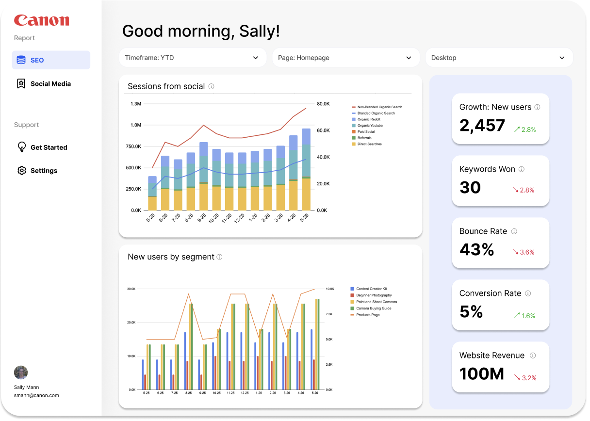
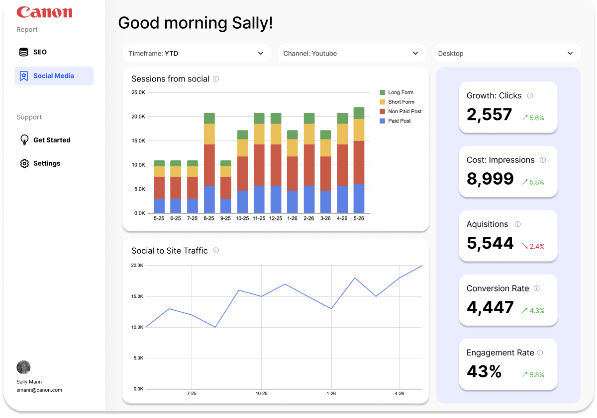
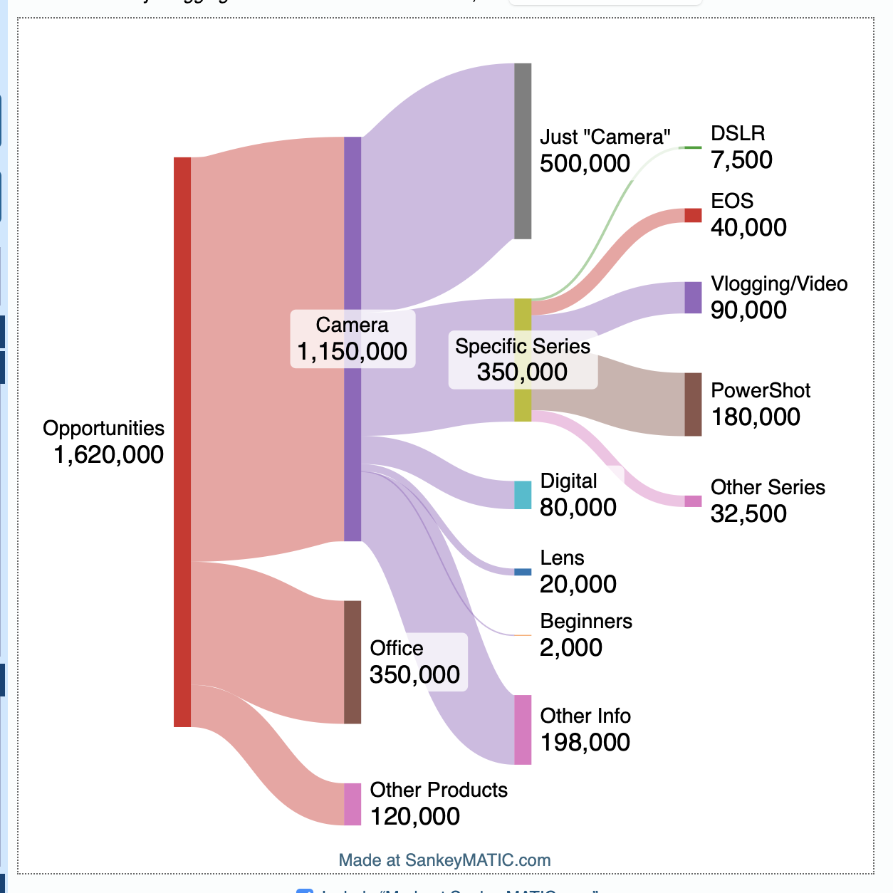
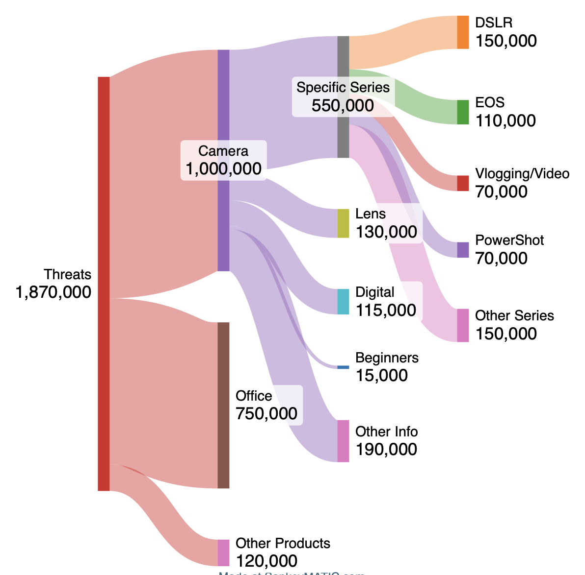

# Canon Case Study -  Digital Analytics
### Juan Zumarán
### Keyword Research & Performance Dashboard

## Brand Background & Problem Statement

Canon is one of the largest photography products, with a mission to empower visual creators through accessible, high-quality technology. For this audit, our team focused on Canon’s target audience of **beginner photographers and content creators**—YouTubers, social media videographers, and newer camera users. The brand’s primary business goals for this product category were increasing non-branded organic search visibility, driving engagement with their “Creator Kit” product page, and ultimately growing revenue from creator-specific and beginner camera bundles.

However, Canon faced a clear strategic problem. In a head-to-head comparison with Sony—their primary competitor in the creator camera space—Canon was consistently **losing organic visibility on the search engine results page**. Key queries such as “best camera for content creators” and “camera for YouTube videos” returned other competitors products in top positions while Canon’s relevant pages appeared much lower, if at all. Compounding this issue, Canon’s paid traffic was not properly assigned in their analytics setup, making it difficult to know whether their paid spend was compensating for organic weaknesses or simply overlapping with it.

Different Insights were needed to accompany the proposed strategy. Which organic search opportunities can Canon win immediately? Which could be long term strategic investments in an effort to obtain more organic searches? My role on the team was to lead the **keyword research** portion of the audit. I was responsible for identifying exactly where Canon was losing, why that mattered, and what strategic recommendations could reverse the trend.

## Data, Tools, & My Individual Role

To investigate Canon’s organic search problem, I used **Semrush** as my primary data source. I exported keyword data for both Canon and Sony across a 90-day period, focusing on queries related to content creation, video production, and creator-specific camera kits. I limited my analysis to keywords that met three criteria: (1) search volume above 1000 monthly searches,  (2) direct relevance to Canon’s Creator Kit product or Beginner Kit and (3): identify where the biggest opportunity lies for Canon. 

I used **Google Sheets** to organize the raw data to segment keywords by Topic, Product and the type of query. 

For the Dashboards, the team understood the difference in making two separate ones, but that the storytelling was also consistent through both of them. The use of interactive filters, big number analytics and detailed charts make these dashboard optimal to evaluate wether the implemented strategy is performing. 

My individual contribution to the team’s audit was **the complete keyword analysis, the resulting content strategy recommendations, and the performance dashboard metrics and design**. I did not work on social analytics, However, my findings directly influenced where the team suggested Canon should focus organic content efforts.

Tools used:
- Semrush (keyword export & competitor gap analysis)
- Google Sheets (data cleaning & manual review, visuals creation for all presentation and dashboards)

Data analyzed:
- 847 keywords total (Canon & Sony combined)
- Search volume, keyword difficulty (KD%), current ranking positions

## Key Insights & Data-Backed Observations

Insight 1: Volume is distributed unevenly, there are KW with very high search volume, but that are owned by other competitors and we consider challenging to win over.

Insight 2: Some KW related to vlogging camera or video camera, and beginner questions are succesfully positioned, but some other related opportunities are easy to win.\

Insight 3: 20% of website traffic is organic search, and 80% is paid traffic. This suggests that Canon is making an effort in targetting relevant keywords, but missing the mark with some.

Insight 4: Intent mismatch between Canon’s existing content and user search behavior. Many searches were categorized as informational, when about 19% of "informational intent" keywords were actually navigational, and 10% were commercial or transactional intent. This is a massive problem for the conversion rate and user intent, that Canon could possibly improve. 

In this Sankey Chart, it summarizes how the opportunites are distributed in terms of search volume. About 2/3 of the search volume is related to cameras, and more specifically, 2,000 monthly searches are related to beginners, and 90,000 are directly related to video/vlog cameras. The opportunities have an average keyword difficulty of 48%, and Canon holds an average position of #12. There are easier low-volume keywords that can be won easily, but since canon is already investing in targetting keywords, they should be classified by quick wins and long term strategic wins.

In this Sankey Chart, it summarizes how the threats are distributed in terms of search volume, these are high search volume queries that Canon holds a significantly lower position than other competitors. About 1/2 of the search volume is related to cameras, and more specifically, 15,000 monthly searches are related to beginners, and 70,000 are directly related to video/vlog cameras. The threats have an average keyword difficulty of 54%, and Canon holds an average position of #43. 

### Recommendations

One of our goals was to Strengthen non-branded content search visibility, By improved keywords related to non-brand searches, which in the case of my analysis:

Immediate Fixes: fixing metadata and targeting keywords with low difficulty (Quick Wins, Keywords with a lower keyowrd difficutly and CPC, such as: "" )

Medium Priority: creating and promoting top of the funnel content on their site and social media

Long Term Keyword Strategy:

1: High Search Volume Opportunities (such as: "vlog camera" or "camera")

2: High Search Volume Threats (such as: "best beginners camera" or "vlogging camera")

#### What I Learned & What Surprised Me

What surprised me most was picking a huge company like Canon and discovering such **basic, fixable gaps** in their keyword strategy. I assumed a brand of that size would have near-perfect organic coverage. Instead, I found a disorganized approach to search intent that a single semester project could realistically improve.

What the brand should do next, if they were to continue this work, is to run the same intent-mapping process for their other product categories (e.g., lenses, entry-level DSLRs).

This project improved my ability to **translate raw keyword data into a persuasive, actionable story** for people who don’t understand SEO.
